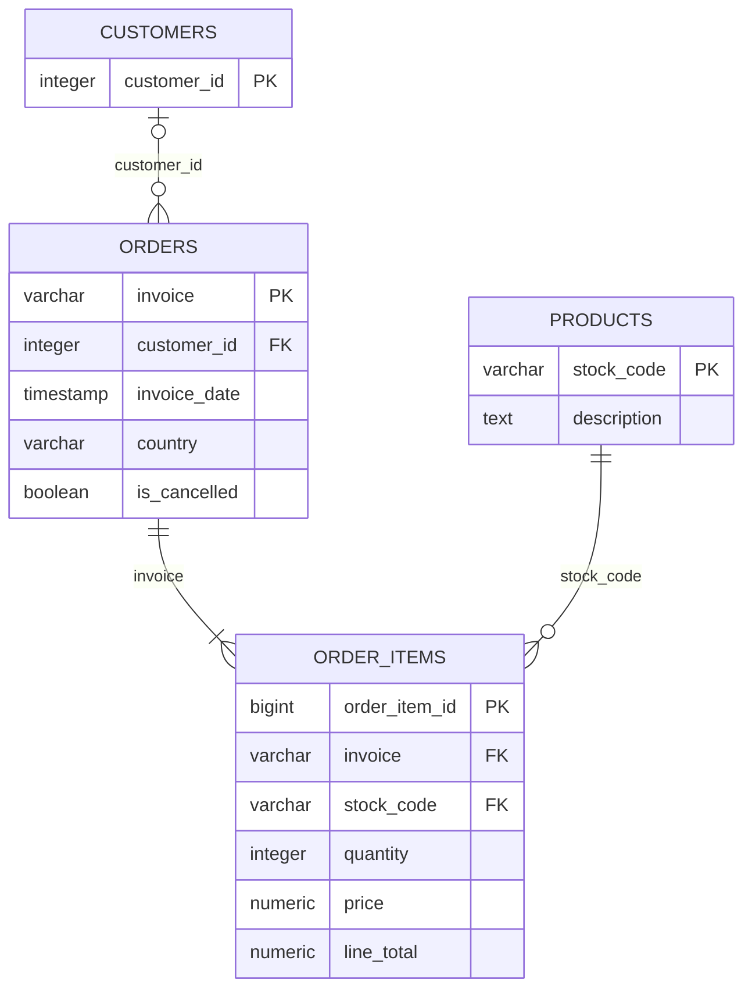

# Retail Data Quality & Customer Analytics

Проект по очистке, проверке качества и анализу транзакционных данных интернет-магазина с последующей нормализацией данных и переносом аналитики в PostgreSQL.

Основная идея проекта — пройти полный путь от сырых данных до аналитической базы: **profiling → cleaning → customer analytics → data modeling → PostgreSQL → SQL analytics**.

## Данные

Использован датасет [UCI Online Retail II](https://archive.ics.uci.edu/dataset/502/online%2Bretail%2Bii) — транзакции британского интернет-магазина за 2009–2011 годы.

DOI: [10.24432/C5CG6D](https://doi.org/10.24432/C5CG6D)

Исходный файл содержит два листа Excel и **1 067 371 строку**.

Данные не хранятся в репозитории: исходный Excel и промежуточные CSV/PKL исключены через `.gitignore`.

## Стек

- Python
- pandas
- matplotlib
- Jupyter Notebook
- PostgreSQL
- SQL
- DBeaver

## Что сделано

### 1. Data profiling

Проверены:

- размер и структура датасета;
- пропуски;
- полные дубликаты;
- уникальность счетов, клиентов и товаров;
- отменённые операции;
- отрицательные количества;
- нулевые и отрицательные цены;
- качество описаний товаров;
- распределение операций по странам.

Основные проблемы исходных данных:

| Проблема | Результат |
|---|---:|
| Строк в исходных данных | 1 067 371 |
| Полные дубликаты | 12 133 |
| Пропуски `customer_id` | 22.77% |
| Отрицательное количество | 22 950 строк |
| Нулевая цена | 6 202 строки |
| Отрицательная цена | 5 строк |

Отрицательное `quantity` не интерпретировалось автоматически как возврат: часть таких операций не имеет стандартного префикса отмены `C`.

### 2. Очистка данных

После удаления полных дубликатов осталось **1 055 238 строк**.

Дополнительно:

- приведены типы данных;
- очищены строковые поля;
- добавлены признаки отменённых операций и отрицательного количества;
- рассчитан `line_total`;
- отделены служебные позиции;
- сохранены строки без `customer_id`, чтобы не терять общую выручку;
- аномальные операции не удалялись без бизнес-основания.

Для анализа обычных продаж использовался отдельный набор:

- **1 025 074** строк продаж;
- **790 739** строк продаж с известным клиентом;
- **39 555** счетов;
- **5 861** клиентов;
- **4 904** товаров;
- выручка — **20 063 266.75**.

Подробнее: [docs/data_quality.md](docs/data_quality.md)

## Анализ клиентов и продаж

### Динамика выручки

Первый и последний неполные месяцы исключены из помесячного сравнения. В обоих годах заметен рост к осени и пик продаж в ноябре.


### Repeat customers

Из 5 861 клиента:

- **72.27%** совершили больше одной покупки;
- **27.73%** сделали только один заказ;
- 41.78% клиентов совершили 2–5 заказов;
- 15.73% — 6–10;
- 14.76% — больше 10.

### Cohort retention

Построен месячный cohort analysis. Когорта декабря 2009 года исключена из интерпретации из-за left censoring.

Для большинства когорт retention на следующих месяцах находится примерно в диапазоне **15–25%**.


### RFM-сегментация

Для клиентов рассчитаны:

- `recency`;
- `frequency`;
- `monetary`.

На их основе выделены сегменты `Champions`, `Loyal`, `Potential loyalists`, `New`, `Promising`, `At risk` и `Hibernating`.

Основная часть выручки приходится на сегменты **Champions** и **Loyal**.


### География продаж

Великобритания значительно доминирует по объёму продаж. Среди остальных стран заметны Ireland/EIRE, Netherlands, Germany, France и Australia.


### Товары и концентрация выручки

- лидер по выручке — `REGENCY CAKESTAND 3 TIER`;
- топ-10 товаров дают **8.03%** выручки;
- топ-100 — **29.44%**;
- некоторые крупные позиции требуют осторожной интерпретации: например, высокий результат `PAPER CRAFT LITTLE BIRDIE` связан с одной очень крупной операцией.

### Временная активность

Наибольшее количество счетов приходится на:

- **Thursday** — 8 184 счёта;
- **12:00** — 6 377 счетов.

Подробные выводы: [docs/analysis_results.md](docs/analysis_results.md)

## Подготовка данных для PostgreSQL

После анализа данные нормализованы в четыре таблицы:



Размеры таблиц после подготовки:

| Таблица | Строк |
|---|---:|
| `customers` | 5 942 |
| `products` | 5 304 |
| `orders` | 53 628 |
| `order_items` | 1 055 238 |

Несколько решений при моделировании:

- `customer_id` в `orders` допускает `NULL`, потому что часть транзакций не привязана к клиенту;
- `country` хранится на уровне заказа: 13 клиентов встречаются более чем в одной стране;
- у 83 счетов есть несколько timestamp, максимальное расхождение — 9 минут, поэтому временем заказа считается минимальный `invoice_date`;
- у 1 213 `stock_code` встречается несколько описаний — выбрано наиболее частое;
- для 355 товаров описание отсутствует;
- цена хранится в `order_items`, потому что она относится к конкретной транзакции.

Подробнее: [docs/data_model.md](docs/data_model.md)

## PostgreSQL и SQL

В PostgreSQL созданы:

- нормализованная схема;
- аналитические представления;
- проверки качества и внешних ключей;
- индексы;
- SQL-версии основных аналитических расчётов.

Основные метрики, cohort retention, repeat rate, RFM, анализ стран, товаров и временной активности воспроизведены в SQL.

SQL-файлы:

- [`01_create_schema.sql`](sql/01_create_schema.sql) — схема и таблицы;
- [`02_create_views.sql`](sql/02_create_views.sql) — `v_sales`, `v_customer_sales` и агрегированные представления;
- [`03_data_quality_checks.sql`](sql/03_data_quality_checks.sql) — проверки качества данных;
- [`04_analytical_queries.sql`](sql/04_analytical_queries.sql) — аналитические запросы;
- [`05_indexes.sql`](sql/05_indexes.sql) — индексы.

Инструкция по импорту: [docs/postgresql_import.md](docs/postgresql_import.md)

## Структура проекта

```text
retail-data-quality-analysis/
├── data/
│   ├── raw/
│   └── processed/
├── notebooks/
│   ├── 01_data_profiling.ipynb
│   ├── 02_data_cleaning.ipynb
│   ├── 03_customer_analysis.ipynb
│   └── 04_prepare_for_postgresql.ipynb
├── sql/
│   ├── 01_create_schema.sql
│   ├── 02_create_views.sql
│   ├── 03_data_quality_checks.sql
│   ├── 04_analytical_queries.sql
│   └── 05_indexes.sql
├── docs/
│   ├── data_model.md
│   ├── data_quality.md
│   ├── analysis_results.md
│   └── postgresql_import.md
├── images/
│   ├── monthly_revenue.png
│   ├── retention_heatmap.png
│   ├── rfm_segments.png
│   └── top_countries.png
├── README.md
├── requirements.txt
└── .gitignore
```

## Запуск

Установить зависимости:

```bash
pip install -r requirements.txt
```

Скачать `Online Retail II` с UCI и указать путь к Excel-файлу в `01_data_profiling.ipynb`.

Ноутбуки запускаются по порядку:

```text
01_data_profiling.ipynb
02_data_cleaning.ipynb
03_customer_analysis.ipynb
04_prepare_for_postgresql.ipynb
```

Последний ноутбук формирует CSV для PostgreSQL:

```text
customers.csv
products.csv
orders.csv
order_items.csv
```

После импорта CSV в PostgreSQL SQL-файлы выполняются в порядке:

```text
01_create_schema.sql
02_create_views.sql
03_data_quality_checks.sql
04_analytical_queries.sql
05_indexes.sql
```

## Итог

Проект показывает полный цикл работы с реальными транзакционными данными: от исследования качества и очистки до customer analytics, проектирования реляционной модели и воспроизведения аналитики в PostgreSQL.
