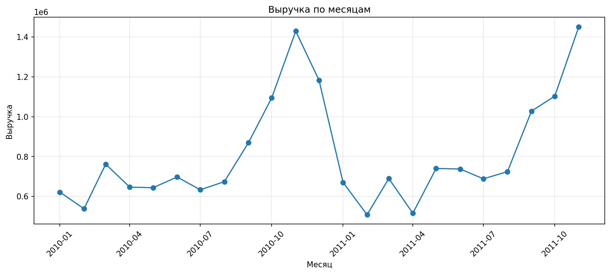
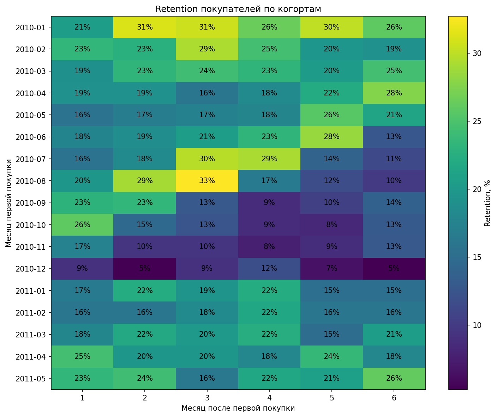
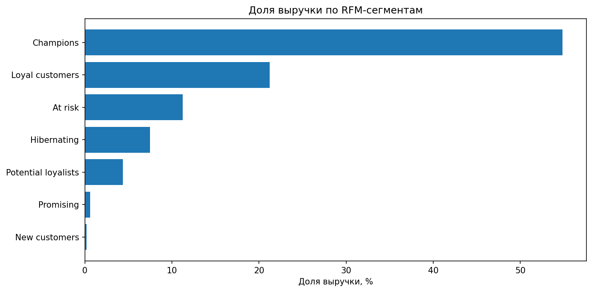
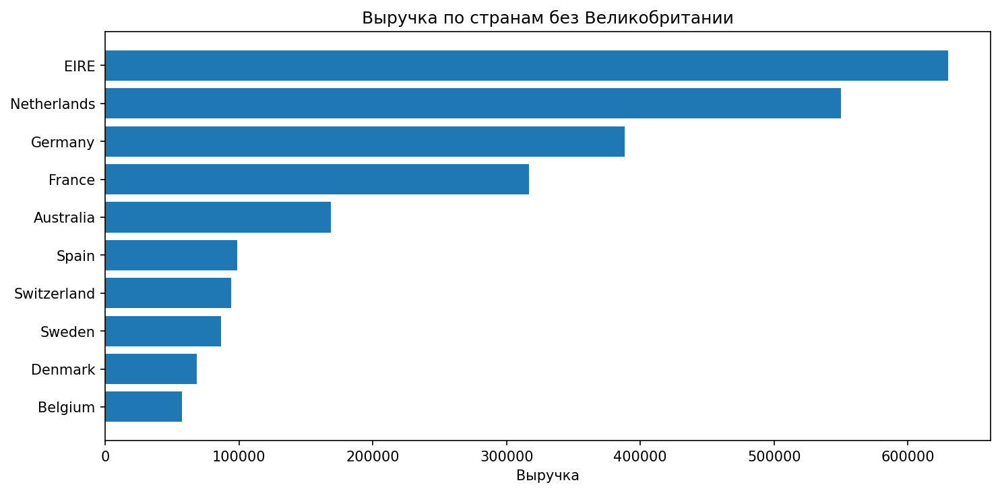
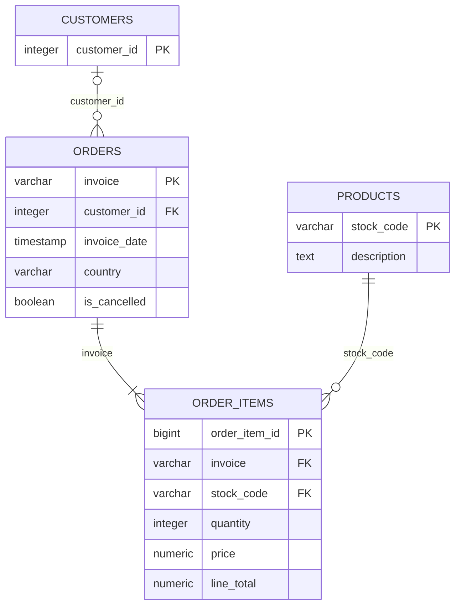

# Retail Data Quality & Customer Analytics

Проект по очистке, проверке качества и анализу транзакционных данных интернет-магазина с последующей нормализацией данных и переносом аналитики в PostgreSQL.

Основной пайплайн проекта:

**data profiling → cleaning → customer analytics → data modeling → PostgreSQL → SQL analytics**

## Данные

Использован датасет [UCI Online Retail II](https://archive.ics.uci.edu/dataset/502/online%2Bretail%2Bii) — транзакции британского интернет-магазина за 2009–2011 годы.

DOI: [10.24432/C5CG6D](https://doi.org/10.24432/C5CG6D)

Исходный датасет содержит **1 067 371 строку**.

Исходный Excel, промежуточные PKL и CSV не хранятся в репозитории.

## Стек

- Python
- pandas
- matplotlib
- Jupyter Notebook
- PostgreSQL
- SQL
- DBeaver

## Data profiling

На первом этапе исследованы структура и качество исходных данных:

- пропуски;
- дубликаты;
- отменённые операции;
- отрицательные количества;
- нулевые и отрицательные цены;
- уникальность счетов, клиентов и товаров;
- качество описаний товаров;
- распределение операций по странам.

Основные проблемы исходных данных:

| Проблема | Значение |
|---|---:|
| Строк в исходных данных | 1 067 371 |
| Полные дубликаты | 12 133 |
| Пропуски `customer_id` | 22.77% |
| Отрицательное количество | 22 950 |
| Нулевая цена | 6 202 |
| Отрицательная цена | 5 |

Отрицательное `quantity` не считалось автоматически возвратом: часть таких операций не имеет стандартного префикса отмены `C`.

## Очистка данных

После удаления полных дубликатов осталось **1 055 238 строк**.

В процессе очистки:

- приведены типы данных;
- очищены строковые поля;
- рассчитан `line_total`;
- добавлены признаки отменённых операций и отрицательного количества;
- отделены служебные позиции;
- сохранены транзакции без `customer_id`, чтобы не терять данные об общей выручке;
- аномальные значения не удалялись без явного бизнес-основания.

Для дальнейшего анализа обычных продаж сформирован отдельный набор данных:

| Метрика | Значение |
|---|---:|
| Строк продаж | 1 025 074 |
| Строк с известным клиентом | 790 739 |
| Счетов | 39 555 |
| Клиентов | 5 861 |
| Товаров | 4 904 |
| Выручка | 20 063 266.75 |

Подробнее: [docs/data_quality.md](docs/data_quality.md)

## Анализ продаж и клиентов

### Динамика выручки

Первый и последний неполные месяцы исключены из помесячного сравнения.

В обоих годах заметен рост продаж к осени и пик в ноябре.



### Repeat customers

Из **5 861** клиента:

- **72.27%** совершили больше одной покупки;
- **27.73%** сделали только один заказ;
- **41.78%** совершили 2–5 заказов;
- **15.73%** — 6–10;
- **14.76%** — больше 10.

### Cohort retention

Построен месячный cohort analysis.

Когорта декабря 2009 года исключена из интерпретации из-за отсутствия более ранней истории клиентов.

Для большинства когорт retention в последующие месяцы находится примерно в диапазоне **15–25%**.



### RFM-сегментация

Для каждого клиента рассчитаны:

- `recency`;
- `frequency`;
- `monetary`.

На их основе клиенты разделены на сегменты:

- Champions;
- Loyal;
- Potential loyalists;
- New;
- Promising;
- At risk;
- Hibernating.

Основная часть выручки приходится на сегменты **Champions** и **Loyal**.



### География продаж

Великобритания значительно доминирует по объёму продаж.

Среди остальных стран наиболее заметны Ireland/EIRE, Netherlands, Germany, France и Australia.



### Товары

- лидер по выручке — `REGENCY CAKESTAND 3 TIER`;
- топ-10 товаров формируют **8.03%** выручки;
- топ-100 товаров — **29.44%**;
- отдельные товары требуют осторожной интерпретации из-за очень крупных единичных заказов.

### Временная активность

Максимальное количество счетов приходится на:

- **Thursday** — 8 184 счёта;
- **12:00** — 6 377 счетов.

Подробные результаты: [docs/analysis_results.md](docs/analysis_results.md)

## Модель данных PostgreSQL

После очистки данные нормализованы в четыре таблицы:



Размеры таблиц:

| Таблица | Строк |
|---|---:|
| `customers` | 5 942 |
| `products` | 5 304 |
| `orders` | 53 628 |
| `order_items` | 1 055 238 |

При проектировании модели были учтены особенности данных:

- `customer_id` в `orders` допускает `NULL`;
- `country` хранится на уровне заказа, так как некоторые клиенты встречаются в нескольких странах;
- у 83 счетов несколько timestamp, поэтому временем заказа считается минимальный `invoice_date`;
- максимальное расхождение timestamp внутри одного счёта — 9 минут;
- у 1 213 `stock_code` встречается несколько описаний, поэтому выбрано наиболее частое;
- для 355 товаров описание отсутствует;
- цена хранится в `order_items`, так как она относится к конкретной транзакции.

Подробнее: [docs/data_model.md](docs/data_model.md)

## SQL-аналитика

В PostgreSQL созданы:

- нормализованная схема;
- аналитические views;
- проверки качества данных;
- проверки внешних ключей;
- индексы;
- SQL-версии основных аналитических расчётов.

В SQL воспроизведены:

- основные метрики;
- месячная динамика;
- repeat customer rate;
- cohort retention;
- RFM-сегментация;
- анализ стран;
- анализ товаров;
- временная активность.

SQL-файлы:

- [`01_create_schema.sql`](sql/01_create_schema.sql) — создание схемы и таблиц;
- [`02_create_views.sql`](sql/02_create_views.sql) — аналитические представления;
- [`03_data_quality_checks.sql`](sql/03_data_quality_checks.sql) — проверки качества данных;
- [`04_analytical_queries.sql`](sql/04_analytical_queries.sql) — аналитические запросы;
- [`05_indexes.sql`](sql/05_indexes.sql) — индексы.

## Структура проекта

```text
retail-data-quality-analysis/
├── data/
│   ├── raw/
│   └── processed/
├── notebooks/
│   ├── 01_data_profiling.ipynb
│   ├── 02_data_cleaning.ipynb
│   ├── 03_customer_analysis.ipynb
│   └── 04_prepare_for_postgresql.ipynb
├── sql/
│   ├── 01_create_schema.sql
│   ├── 02_create_views.sql
│   ├── 03_data_quality_checks.sql
│   ├── 04_analytical_queries.sql
│   └── 05_indexes.sql
├── docs/
│   ├── data_model.md
│   ├── data_quality.md
│   ├── analysis_results.md
│   └── postgresql_import.md
├── images/
│   ├── monthly_revenue.png
│   ├── retention_heatmap.png
│   ├── rfm_segments.png
│   └── top_countries.png
├── README.md
├── requirements.txt
└── .gitignore
```

## Запуск Python-части

Установить зависимости:

```bash
pip install -r requirements.txt
```

Скачать `Online Retail II` с UCI и указать путь к Excel-файлу в первом ноутбуке.

Ноутбуки запускаются по порядку:

```text
01_data_profiling.ipynb
02_data_cleaning.ipynb
03_customer_analysis.ipynb
04_prepare_for_postgresql.ipynb
```

Последний ноутбук формирует четыре CSV:

```text
customers.csv
products.csv
orders.csv
order_items.csv
```

## Запуск PostgreSQL-части

Сначала выполнить:

```text
01_create_schema.sql
```

После создания таблиц импортировать CSV в следующем порядке:

```text
customers.csv
products.csv
orders.csv
order_items.csv
```

Порядок важен из-за внешних ключей.

После импорта выполнить:

```text
02_create_views.sql
03_data_quality_checks.sql
04_analytical_queries.sql
05_indexes.sql
```

Подробная инструкция по импорту: [docs/postgresql_import.md](docs/postgresql_import.md)

> `01_create_schema.sql` пересоздаёт схему `retail`, поэтому повторный запуск этого файла удалит ранее импортированные данные.

## Итог

Проект показывает полный цикл работы с реальными транзакционными данными: от исследования качества и очистки более миллиона строк до customer analytics, проектирования реляционной модели и воспроизведения аналитических расчётов в PostgreSQL.
