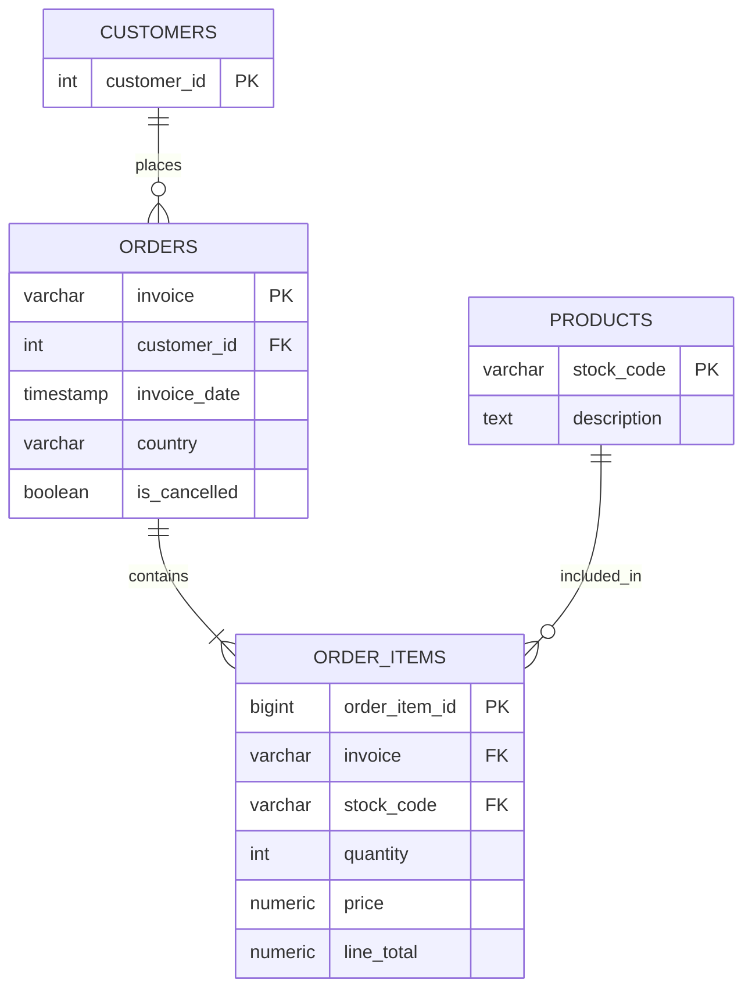

# Модель данных

После очистки исходная транзакционная таблица разделена на четыре сущности.

## Решения по нормализации

`country` хранится в `orders`, а не в `customers`: в данных 13 покупателей встречаются более чем в одной стране.

Для 83 счетов позиции имеют несколько близких значений времени. Максимальная разница составляет 9 минут, поэтому временем счета считается минимальный `invoice_date`.

У 1 213 кодов товара встречается больше одного описания. Для справочника `products` выбирается наиболее часто встречающееся непустое описание.

355 кодов товара не имеют описания вообще. Такие товары остаются в справочнике с `NULL` в `description`, чтобы не нарушать связи с `order_items`.

`price` хранится в `order_items`, потому что цена товара может меняться между транзакциями.

`line_total` является производным полем (`quantity * price`). Оно сохранено для сверки результатов Python и SQL; при необходимости его можно вычислять на лету.
